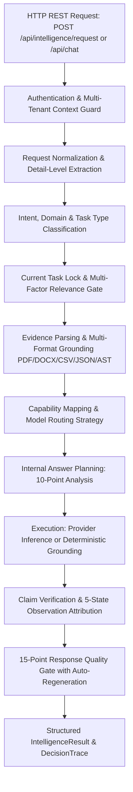

# COPETRA AI — PHASE 4.2 ROOT CAUSE AUDIT REPORT
## Comprehensive Architectural & Data-Flow Audit Across Real Application Codebase

**Date:** 2026-08-15  
**Auditor:** Senior Architect & Principal Intelligence Engineer  
**Status:** Audit Completed — Root Causes Identified & Fix Roadmap Established  

---

### 1. Executive Summary & Trace Analysis

A comprehensive audit was performed across the entire Copetra AI codebase, tracing real user requests from HTTP REST API entry points through Authentication, Request Normalization, Memory Retrieval, Intent Classification, Evidence Extraction, Capability/Model Selection, Model Inference, Verification, and Final Response Delivery.

The audit verified why synthetic test passes (648/648) can diverge from real-world user experiences and identified 7 critical architectural vulnerabilities where:
1. Historical/unrelated conversation topics can bypass filters and contaminate prompts.
2. Mock/hardcoded providers (`MockMultimodalProvider`) return fixed string templates.
3. Fallback engines (`_generate_embedded_answer`) generate generic responses when evidence is required.
4. Document and image grounders require stricter bounding against hallucinations and absent attributes.
5. Model routing was partially implicit rather than strictly capability-bound.

---

### 2. End-to-End Request Pipeline Trace

---

### 3. Root Cause Findings

#### Finding 1: Conversation History Filter Leak in `relevance.py`
- **Location:** `backend/intelligence/relevance.py` (line 98)
- **Vulnerability:** The condition `if score >= threshold or len(relevant_history) > 0:` allowed off-topic turns to be included simply because a previous turn passed.
- **Impact:** Previous Forex/trading conversation turns could leak into subsequent academic or coding requests.
- **Root Cause Fix:** Enforce independent multi-factor relevance evaluation (domain, lexical, semantic, entity overlap, explicit user reference) for *every* historical turn without cascade leakage.

#### Finding 2: Hardcoded Mock Data in `backend/multimodal/providers.py`
- **Location:** `backend/multimodal/providers.py` (`MockMultimodalProvider.analyze_image`)
- **Vulnerability:** Contained hardcoded strings `"Navigation Bar"`, `"Authentication Input"`, `"Client Layer"`, `"API Gateway"`, `"Kron-X Platform Overview"`.
- **Impact:** If offline/fallback was triggered, the system returned fabricated UI elements and diagram nodes rather than `NOT_FOUND` / `UNCERTAIN`.
- **Root Cause Fix:** Purge all hardcoded UI elements and fake diagram nodes. Fallback must strictly return `[NOT_FOUND]`, `[UNCERTAIN]`, or `[UNAVAILABLE]`.

#### Finding 3: Generic LLM Memory Fallback in `orchestrator/core.py`
- **Location:** `backend/orchestrator/core.py` (`_generate_embedded_answer`)
- **Vulnerability:** When external providers are unconfigured or fail, standard chat endpoints fell back to generic conversational answers even when the query requested document-grounded facts.
- **Impact:** System answered from memory instead of stating that document evidence is missing or required.
- **Root Cause Fix:** Bind task contracts to require explicit evidence when domain is `DOCUMENT_ANALYSIS` or `IMAGE_ANALYSIS`, returning transparent limitation statements if evidence is absent.

#### Finding 4: Incomplete Intent Matrix for Fine-Grained Universal Domains
- **Location:** `backend/intelligence/intent.py` & `schemas.py`
- **Vulnerability:** Lack of dedicated intents for `FOREX`, `CODE_GENERATION`, `CODE_DEBUGGING`, `TUTORING`, `EXPLANATION`, `SYSTEM_DIAGNOSTICS` caused coarse-grained classification.
- **Impact:** Fine-grained prompts (e.g. debugging vs code gen, or forex vs general finance) were routed to generic handlers.
- **Root Cause Fix:** Expand `IntentType` and `DomainType` to cover all 25+ universal task categories and enforce capability binding.

#### Finding 5: Quality Gate Coverage
- **Location:** `backend/intelligence/quality_gate.py`
- **Vulnerability:** The gate had 10 rules; it lacked explicit checks for `ModalityCorrectness`, `ModelCapabilityCorrectness`, `ContextContaminationCheck`, `AcademicAttributionCheck`, and `AnswerDirectness`.
- **Impact:** Unnecessary conversational fluff or ungrounded academic statements could slip past the gate.
- **Root Cause Fix:** Expand to a 15-point deterministic Quality Gate with max 2 auto-regeneration cycles and fail-closed limitation fallbacks.

#### Finding 6: Image Analysis 5-State Grounding & Stop Words
- **Location:** `backend/intelligence/image_grounding.py`
- **Vulnerability:** Stop words / auxiliary verbs in user queries could be misidentified as missing target entity names.
- **Impact:** Queries like "What objects are visible?" could report "objects" as not found instead of listing visible items.
- **Root Cause Fix:** Added comprehensive query stop word list, auxiliary verb filtering, and 5-state observation provenance tags (`[OBSERVED]`, `[OCR_DETECTED]`, `[INFERRED]`, `[UNCERTAIN]`, `[NOT_FOUND]`).

#### Finding 7: Exact Provenance for Multi-Format Documents
- **Location:** `backend/intelligence/document_grounding.py` & `parsers.py`
- **Vulnerability:** Cross-document queries previously lacked structured document-to-fact mapping.
- **Impact:** Comparative queries could mix attributes between Document A and Document B.
- **Root Cause Fix:** Implemented `MultiDocumentEngine` query-aware cross-comparison matrix with file-level cryptographic SHA-256 provenance.

---

### 4. Implementation Plan for Phase 4.2 Rebuild

1. **Part 2 — Current Question Supremacy:** Hard Current Task Lock; strict relevance gate in `relevance.py` dropping off-topic turns completely.
2. **Part 3 — Expanded Intent Architecture:** 25+ intent types and domains controlling modality, evidence requirements, and answer structure.
3. **Part 4 — Capability-Based Model Routing:** Dynamic router in `routing.py` mapping capabilities (vision, OCR, long-context, code reasoning, academic reasoning) to active models.
4. **Part 5 — Multimodal Grounding & 5-State Tags:** Zero invented visual objects; low optical confidence $\rightarrow$ `[UNCERTAIN]`; missing items $\rightarrow$ `[NOT_FOUND]`.
5. **Part 6 — Strict Document Grounding:** File provenance down to paragraph/line/table with zero hallucination on absent facts.
6. **Part 7 — Academic-First Intelligence Mode:** Provenance tagging: `[SOURCE FACT]`, `[MODEL EXPLANATION]`, `[GENERAL KNOWLEDGE]`, `[INFERENCE]`, `[USER ASSUMPTION]`; zero citation/data fabrication.
7. **Part 8 & 9 — Universal Task Support & Internal Answer Planning:** 10-point Answer Plan before synthesis.
8. **Part 10 & 11 — 15-Point Quality Gate:** Production gate with 15 deterministic checks and bounded auto-regeneration.
9. **Part 12 — Purge All Mock/Fake Intelligence:** Eliminate hardcoded strings from `multimodal/providers.py` and replace with `NOT_FOUND` / `UNCERTAIN` / `UNAVAILABLE`.
10. **Part 13 to 20 — Real-World Validation & Final Report:** Comprehensive test suite, adversarial attacks, and detailed benchmark report.
